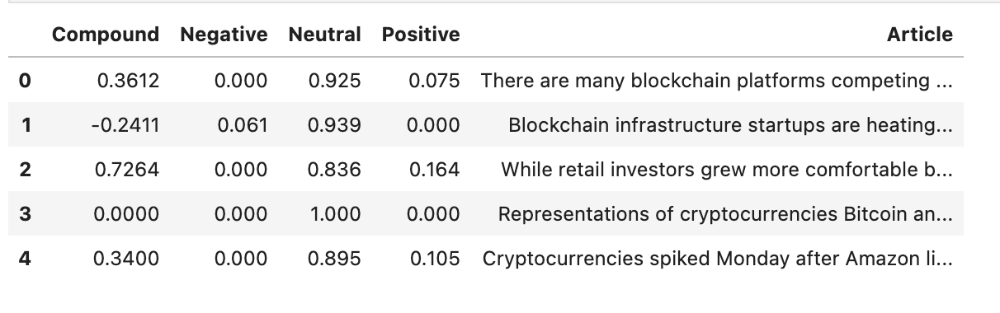
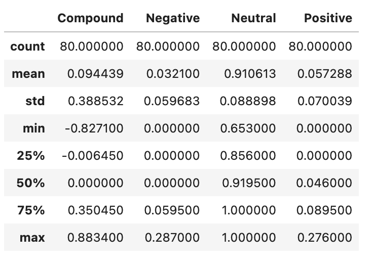
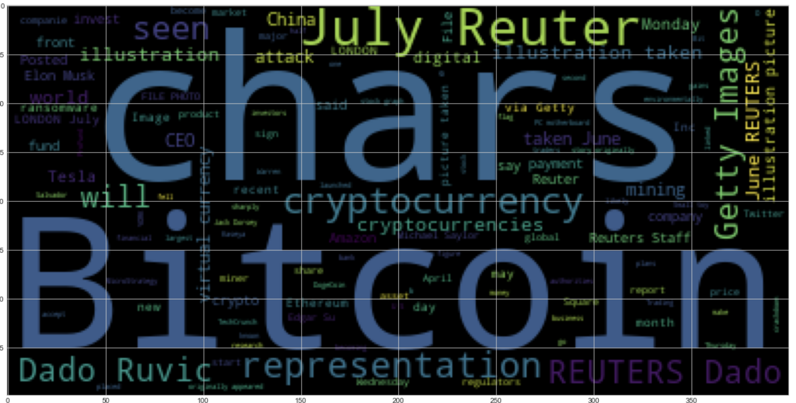
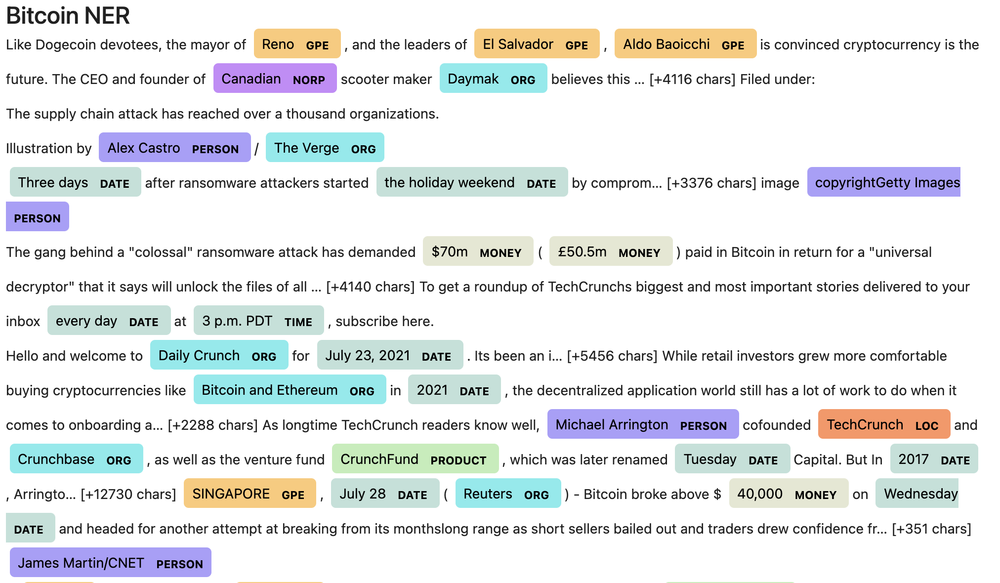

# Natural Language Processing - an analysis of sentiment on cryptocurrencies


The intent of this project is to analyse the sentiment on cryptocurrencies using Natural Language Processing techniques: what are the articles saying about cryptocurrencies and what does it mean?

## Main Notebook with developped code

[Starter Notebook](Main/crypto_sentiment.ipynb)

## Project Sumary

The first step is to set-up the API keys and fetch the crypotocurrencies news articles:

```{python}
bitcoin_articles = newsapi.get_everything(q="bitcoin", language="en" page_size=80, sort_by="relevancy")

ethereum_articles = newsapi.get_everything(q="ethereum",language="en", page_size=80,sort_by="relevancy")

```

The sencond step is try create a for loop code which will create the sentiment score dataframe for each cryptocurrency:

```{python}
bitcoin_sentiments = []

for article in bitcoin_articles["articles"]:
    try:
        text = article["content"]
        date = article["publishedAt"][:10]
        sentiment = analyzer.polarity_scores(text)
        compound = sentiment["compound"]
        pos = sentiment["pos"]
        neu = sentiment["neu"]
        neg = sentiment["neg"]
        
        bitcoin_sentiments.append({
            "Article": text,
            "Date": date,
            "Compound": compound,
            "Positive": pos,
            "Negative": neg,
            "Neutral": neu
            
        })
        
    except AttributeError:
        pass
```

with the DataFrame and results, it is required to .describe() the dataframe in order to understand the weight and numbers for the sentiment.



-------------

## Tokenizing and Generating WordCloud: 
It is equally important to see and understand the words which were used more frenquently in the articles analyzed. Tokenization can help with transforming the words in the articles into tokens and WordCloud can help with visualizing the most common words used.

Necessary imports for Tokenizing:
```{python}
from nltk.tokenize import word_tokenize, sent_tokenize
from nltk.corpus import stopwords
from nltk.stem import WordNetLemmatizer, PorterStemmer
from string import punctuation
import re
lemmatizer = WordNetLemmatizer()
```

Function created to tokenize words from the article:

```{python}
def tokenizer(text):
    """Tokenizes text."""
    
    sw = set(stopwords.words('english'))
    # Convert the words to lowercase
    regex = re.compile("[^a-zA-Z ]")  
    # Remove the punctuation from text
    re_clean = regex.sub('', text)
    # Remove the stop words
    words = word_tokenize(re_clean)
    # Lemmatize words into root words
    lem = [lemmatizer.lemmatize(word) for word in words]
    tokens = [word.lower() for word in lem if word.lower() not in sw.union(sw_addons)]
   
    return tokens
```

Function created to look at the word frequency in each data frame/article:

```{python}
from collections import Counter
from nltk import ngrams

def token_count(tokens, N=10):
    """Returns the top N tokens from the frequency count"""
    return Counter(tokens).most_common(N)
```

Using WordCloud to visualize the main words used in the articles:

```{python}
from wordcloud import WordCloud
import matplotlib.pyplot as plt
plt.style.use('seaborn-whitegrid')
import matplotlib as mpl
mpl.rcParams['figure.figsize'] = [20.0, 10.0]

wc = WordCloud().generate(bitcoin_article)
plt.imshow(wc)
```


--------

## Named Entity Recognition (NER):
NER is a great tool to help create texts which are easy for the human eye to analyze: it highlights the words which are most used and categorizes them as well.

```{python}
import spacy
from spacy import displacy

nlp = spacy.load('en_core_web_sm')

bitcoin_article = ' '.join(bitcoin_articles_df.Article)
bitcoin_article

# Run the NER processor on all of the text
bitcoin_doc = nlp(bitcoin_article)

# Render the visualization
displacy.render(bitcoin_doc, style='ent')
```
